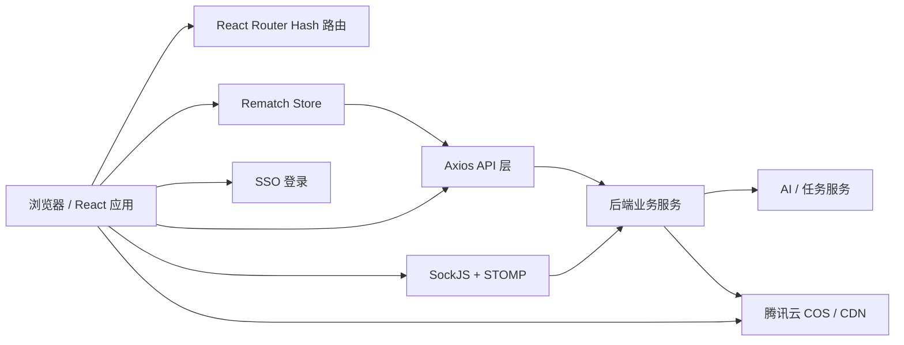
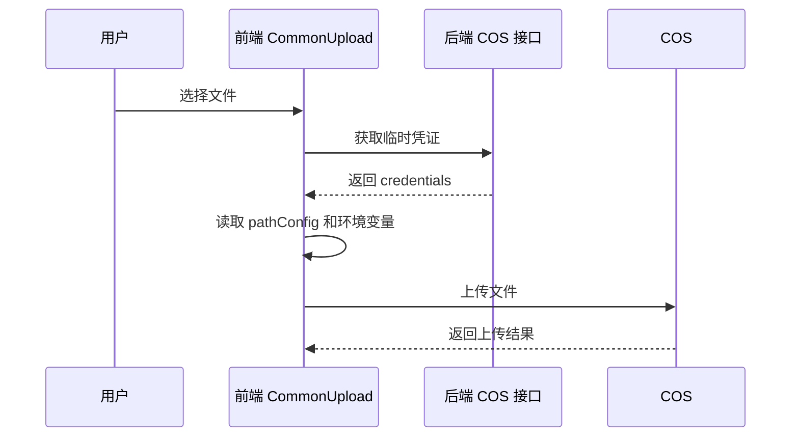

# 系统架构

## 总体结构



## 前端分层

| 层级 | 位置 | 职责 |
| --- | --- | --- |
| 应用入口 | `src/main.tsx`、`src/App.tsx` | 注入主题、语言包、状态容器和路由。 |
| 路由层 | `src/router/index.tsx` | 定义首页、剧本页、视频页和 404。 |
| 页面层 | `src/pages/` | 承载业务流程页面。 |
| 组件层 | `src/components/` | 通用布局、弹窗、上传、输入、图标。 |
| 状态层 | `src/store/models/` | 管理用户、项目详情、会话、剧本、分镜和资源历史。 |
| 接口层 | `src/api/models/` | 封装 HTTP、流式请求和任务接口。 |
| 工具层 | `src/utils/`、`src/hooks/` | Token、COS、下载、Socket、缓存请求等能力。 |

## 路由架构

| 路由 | 页面 | 说明 |
| --- | --- | --- |
| `/` | `Home` | 我的项目列表。 |
| `/project/:id/script` | `AIProject/Main/Sctipt` | 剧本设计页，进入前会加载用户信息。 |
| `/project/:id/video` | `AIProject/Main/Video` | 镜头设计页，进入前会加载用户信息。 |
| `*` | `NotFound` | 未匹配页面。 |

项目使用 `createHashRouter`，因此真实访问形态是 `#/project/:id/script`。

## 状态架构

| Model | 文件 | 主要状态 |
| --- | --- | --- |
| `auth` | `src/store/models/auth.ts` | 当前用户信息。 |
| `aiScript` | `src/store/models/aiScript.ts` | 当前项目、当前会话、聊天历史、剧本列表、剧本生成状态。 |
| `aiVideo` | `src/store/models/aiVideo.ts` | 当前分镜、分镜列表、图片/视频/音频资源历史、终选资源。 |
| `common` | `src/store/models/common.ts` | COS 路径配置。 |

## 请求架构

所有普通 HTTP 请求经过 `src/api/index.ts` 的 Axios 实例：

- 请求头自动带 `Authorization: localStorage.token`。
- 业务成功码为 `200`。
- 业务过期码 `30001` 会跳转登录。
- 默认超时时间为 120 秒。

流式文本生成存在两种实现：

- `src/api/models/chat.ts` 使用 `fetchEventSource` 请求文本流。
- 当前剧本页主要通过 STOMP 发送 `/app/ai/stream/session/chat`，再订阅用户队列接收回复。

## 实时消息架构

`useStompSocket` 负责创建连接：

```ts
new StompSocket({
  baseUrl: import.meta.env.VITE_SOCKET_BASE,
  sendThorough,
  subscribeThorough: subscribeThorough.map(v => `${v.path}/${accountId}`),
})
```

订阅通道会追加 `accountId`，例如：

```text
/user/queue/task/text2img/{accountId}
/user/queue/session/chat/reply/{accountId}
```

`StompSocket` 内置最多 3 次重连，每次间隔 5 秒。

## 文件与 COS 架构

应用启动时，`App.tsx` 通过 `useFetchWithCache(getCosCredential, 3600 * 1000, 'session')` 缓存 COS 临时凭证。

上传链路：



下载链路分为两类：

- 普通后端文件：`downloadFromServer` 通过 Axios 下载 Blob。
- COS 对象：`downloadCosObjectFile` 通过临时凭证读取对象并创建浏览器下载链接。
