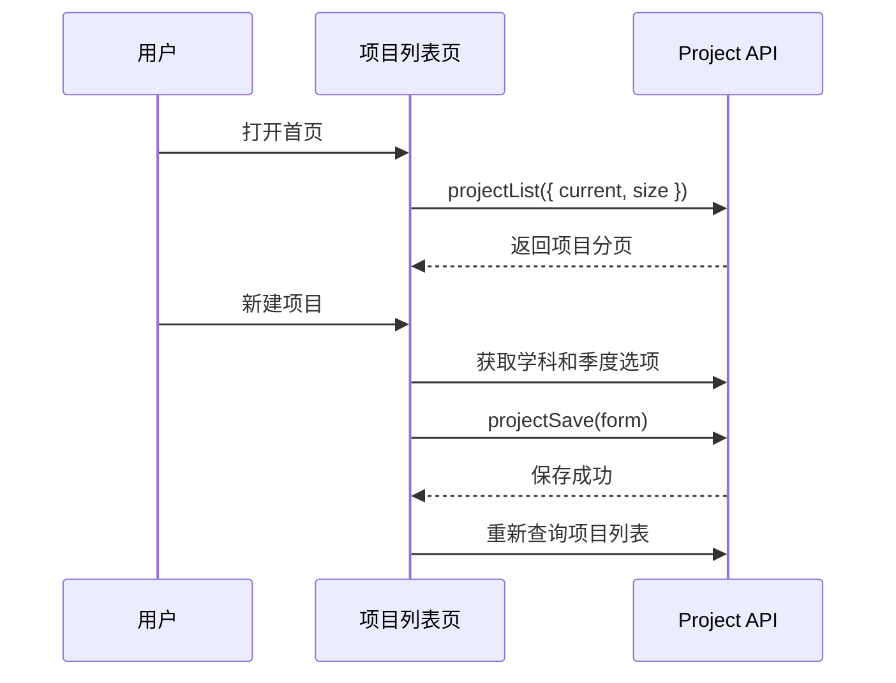
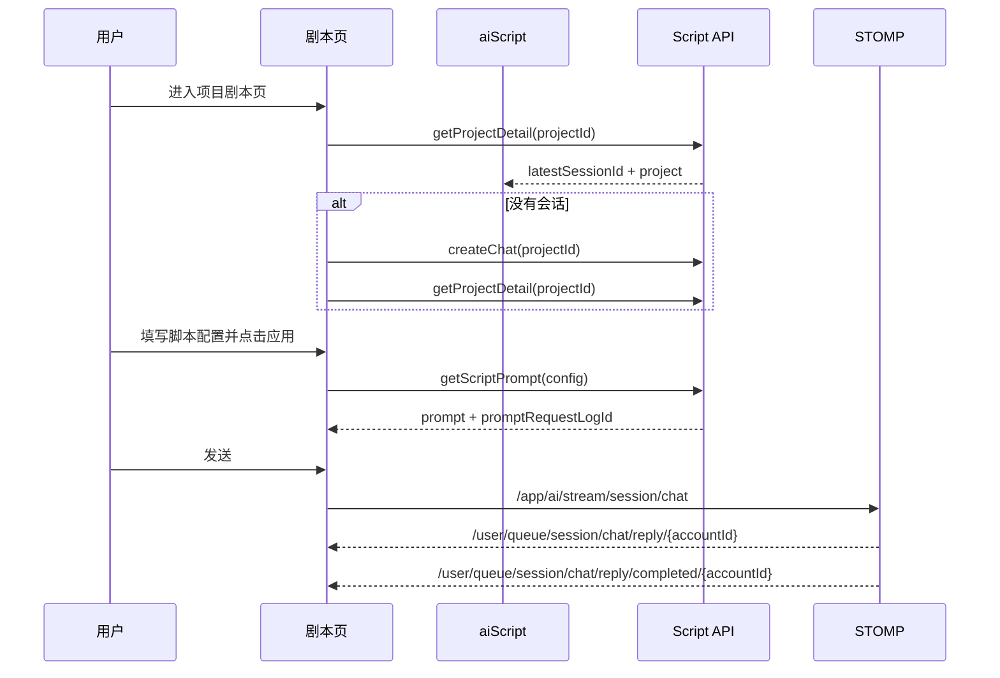
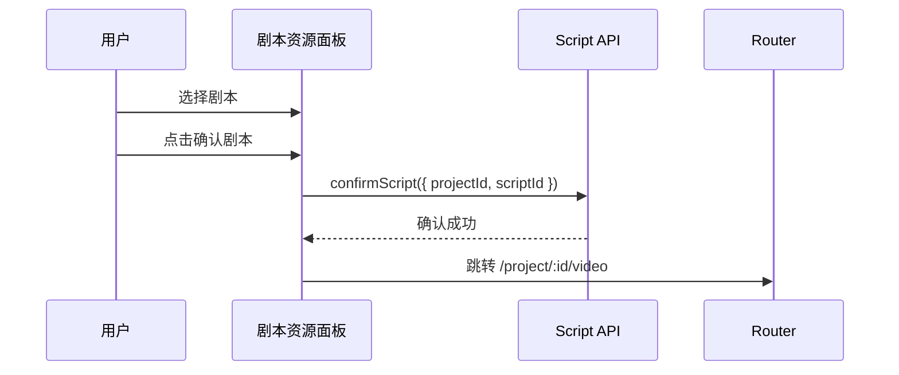
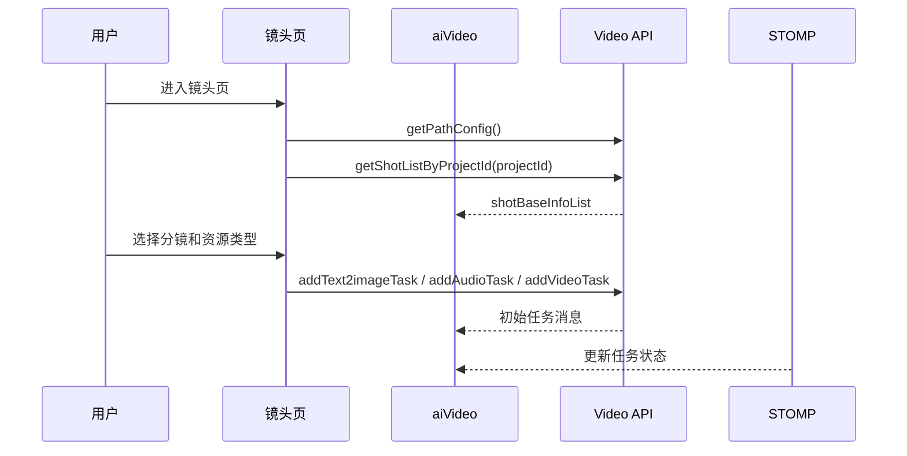
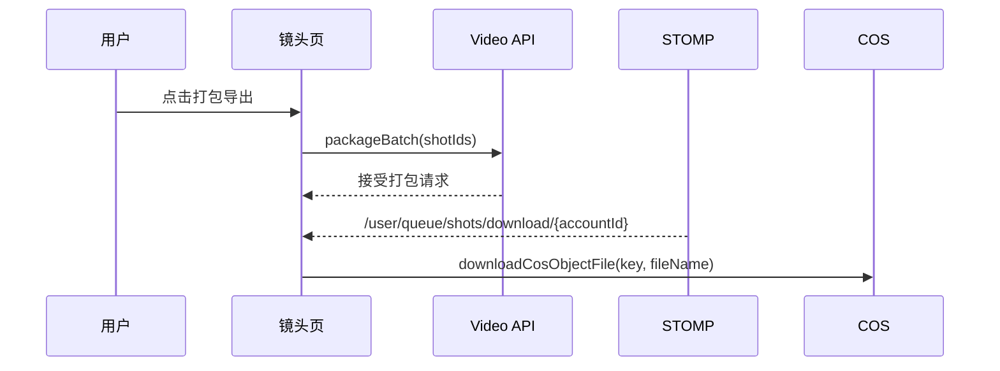

# 核心业务流程

## 项目管理流程

项目列表根据 `state` 决定编辑入口：

| 状态 | 文案 | 入口 |
| --- | --- | --- |
| `ScriptProcessing` | 剧本制作中 | `/project/:id/script` |
| `VideoProcessing` | 画面制作中 | `/project/:id/video` |
| `Completed` | 已完成 | `/project/:id/video` |

## 剧本设计流程

剧本页左侧是聊天生成，右侧是剧本资源列表。

用户可以：

- 应用配置生成 Prompt。
- 上传附件并随消息发送。
- 新建对话。
- 下载剧本模板。
- 导入 `.md`、`.xlsx`、`.docx` 剧本。
- 选择一个剧本并确认，确认后进入镜头设计页。

## 剧本确认流程

## 镜头设计流程

镜头页由三块组成：

| 区域 | 说明 |
| --- | --- |
| 左侧 | 分镜列表，选择当前 `shotId`。 |
| 中间 | 当前资源类型的生成/对话操作区。 |
| 右侧 | 图片、视频、音频、结果等资源面板。 |

## 资源生成与确认

资源类型包括：

| 类型 | 枚举 | 生成接口 |
| --- | --- | --- |
| 图片 | `image` | `addText2imageTask` |
| 视频 | `video` | `addVideoTask` |
| 音频 | `voice` | `addAudioTask` |

任务状态包括：

| 状态 | 文案 |
| --- | --- |
| `Queued` | 队列中 |
| `Processing` | 生成中 |
| `Completed` | 已完成 |
| `Transcoding` | 转码中 |
| `Failed` | 已失败 |

用户可以对资源进行：

- 查看历史。
- 添加到资源库。
- 删除资源。
- 重新生成任务。
- 确认为当前分镜的终选资源。

## 打包导出流程

前端只发起打包请求和下载文件，具体打包过程由后端完成。
