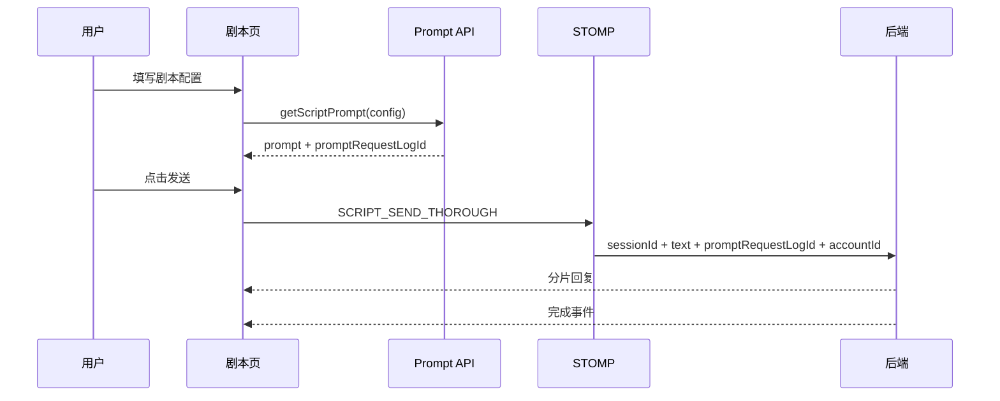
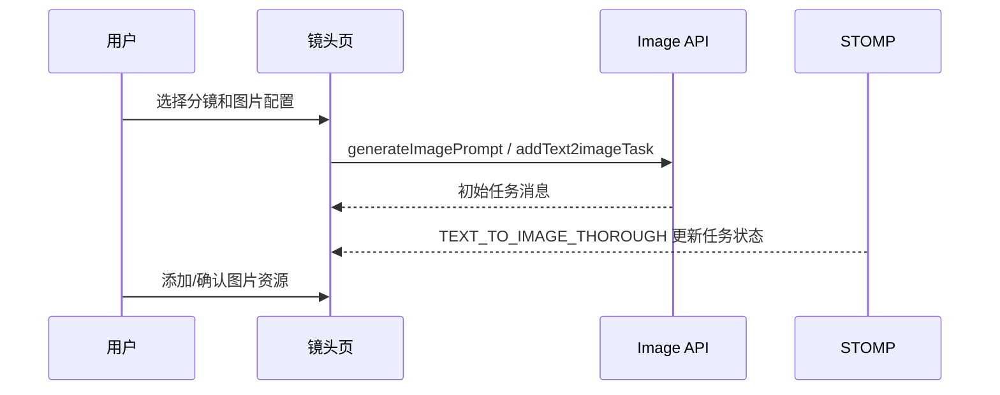
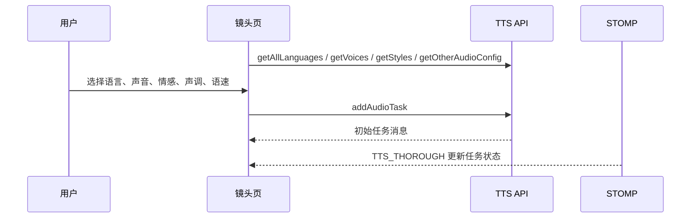
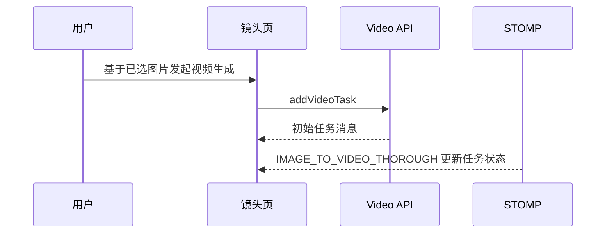

# AI 工作流

## 总览

项目中的 AI 能力分为四类：

| 能力 | 前端入口 | 后端能力 |
| --- | --- | --- |
| 剧本生成 | 剧本页聊天区 | Prompt 解析、文本生成、会话历史。 |
| 图片生成 | 镜头页图片生成区 | 文生图任务、图片资源历史、修整选项。 |
| 音频生成 | 镜头页音频生成区 | TTS 语言、声音、情感、声调、语速配置和任务。 |
| 视频生成 | 镜头页视频生成区 | 图生视频任务和视频资源历史。 |

前端主要负责配置采集、任务发起、消息展示和资源确认。真正的模型调用和任务执行由后端完成。

## 剧本生成链路

默认剧本参数在 `ChatControl.tsx` 中设置：

| 字段 | 默认值 | 说明 |
| --- | --- | --- |
| `duration` | `120` | 总时长，单位秒。 |
| `shotNum` | `14` | 镜头数量。 |
| `wordNum` | `600` | 剧本字数。 |

聊天回复通过 `convertToMarkdown` 转换换行和空格后展示。

## 剧本保存和确认

保存剧本有两种相关动作：

| 动作 | 接口/通道 | 说明 |
| --- | --- | --- |
| 将对话内容保存为剧本 | `saveScript`，并监听 `SCRIPT_ADD_THOROUGH` | 后端保存后推送结果，前端刷新剧本列表。 |
| 确认剧本 | `confirmScript` | 成功后跳转镜头设计页。 |

确认剧本后，项目进入后续镜头资源生产流程。

## 图片生成链路

相关接口：

- `getImagePromptBtnList`
- `generateImagePrompt`
- `addText2imageTask`
- `getText2imageHistories`
- `postSaveImage`
- `addResource`
- `confirmResource`

## 音频生成链路

音频参数：

| 字段 | 说明 |
| --- | --- |
| `languagesName` | 语言。 |
| `shortName` | 声音。 |
| `style` | 情感/风格。 |
| `pitch` | 声调。 |
| `rate` | 语速。 |

## 视频生成链路

视频参数：

| 字段 | 说明 |
| --- | --- |
| `conditionFactor` | 条件因子，范围由后端/模型约束。 |
| `fps` | 帧率。 |
| `motionBucketId` | 镜头运动控制。 |
| `seed` | 随机种子。 |

## 任务状态更新

图片、音频、视频任务都复用 `aiVideo.updateMessage` 更新本地任务历史。

任务状态：

| 状态 | 说明 |
| --- | --- |
| `Queued` | 已入队。 |
| `Processing` | 生成中。 |
| `Completed` | 已完成。 |
| `Transcoding` | 转码中。 |
| `Failed` | 已失败。 |

## 重试与失败处理

当前前端提供 `reinstateTask(taskId)` 用于重新生成任务。

已知限制：

- 前端只展示后端返回的任务状态，失败原因字段未在统一类型中明确。
- Socket 重连最多 3 次，超过后不再自动恢复。
- 若用户刷新页面，任务历史依赖后端历史接口重新拉取。
